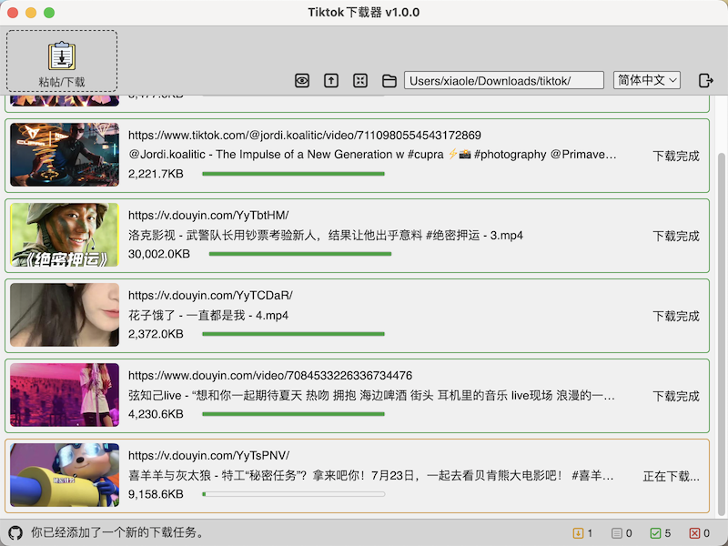
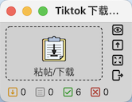

### TikDown
- This is a Tiktok/Douyin video downloader, build by Electron. To download video without watermark by only pasting shared link.
- 这是一个使用了Electron构建的 Tiktok/抖音 下载器。通过粘帖剪贴板里的分享链接下载无水印的视频。


### Install 安装
- Install from brew: 用brew安装：
```
brew tap Tairraos/tikdown && brew install --cask tikdown
```
- Check to see new version. 用这个命令检测是否有新版本。
```
brew livecheck tikdown
```
- Download install package for win/mac. 下载 Win/Mac 安装包： 
https://github.com/Tairraos/TikDown/releases/tag/v1.0.0
- Provided Mac & Win, if you wanna to run app under Linux, please clone repo and build by yourselves.
- 仅提供 Mac 和 Win 的 App，如果你需要在 Linux 下使用，请自己克隆仓库编译。
- Find Homebew tap of TikDown here. Homebrew tap在这里维护： 
https://github.com/Tairraos/homebrew-tikdown

### Instruction 介绍
-  / watch clipboard(auto paste) / 监视剪贴板(自动粘贴)
-  / stop watch / 停止监视
-  / Keep window on top / 保持窗口置顶
-  / Quit top / 退出置顶
-  / Normal window mode / 普通窗口模式
-  / Mini Window Mode / 迷你窗口模式
-  / Change save folder / 更改保存位置
-  / Quit app / 结束程序
-  / Numbers of waiting download / 等待下载的数量
-  / Numbers of downloading / 下载中的数量
-  / Numbers of downloaded / 已下载的数量
-  / Numbers of download faileds / 失败的数量


### Design Source 设计源
- https://mastergo.com/file/64638217599752


### Comments 备注
- 
- The chrome app version of Tiktok/Douyin works very good. 
- Chrome app版本的Tiktok/Douyin很好用.
- Visit Tiktok/Douyin site via chrome, and you will see installation icon on the right of the address bar. 
- 用Chrome访问Tiktok/Douyin网站，在地址栏最右侧有安装图标。
- If you are looking for a Python app, there is a tiny python version of this app only 100 lines code. [Go to Python Version](https://github.com/Tairraos/tiktok-downloader.py)
- 如果你在找 Python App, 我有一个100行代码的Pythont版本。 [跳转到Python版本](https://github.com/Tairraos/tiktok-downloader.py)
- 

### Screenshot 截图





### Reference & Thanks 参考及鸣谢
- API Information / API 信息: [Github Repo](https://github.com/Evil0ctal/Douyin_TikTok_Download_API)
- background material / 安装程序背景: [Tiktok background vector created by BiZkettE1](https://www.freepik.com/vectors/tiktok-background)
- arraw material / 箭头素材： [Trajectory vector created by freepik](https://www.freepik.com/vectors/trajectory)