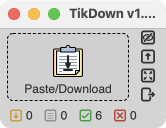
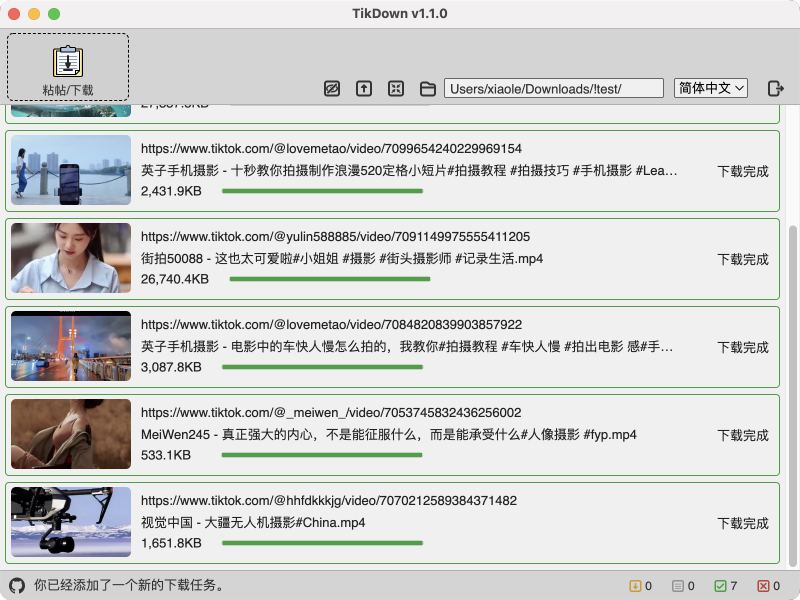
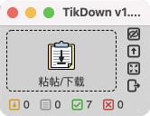

### TikDown

[点这里查看中文说明](#中文说明)

This is a TikTok/Douyin downloader built with Electron. Download the video without watermark by pasting the share link in the clipboard.

### Install
- Install with brew
```
brew tap Tairraos/tikdown && brew install --cask tikdown
```
- Use this command to check if new version is available
```
brew livecheck tikdown
```
- Download the Win/Mac installation package  
https://github.com/Tairraos/TikDown/releases/latest
- The application is only available for Mac and Win. If you want to use it under Linux, please clone this repository and build it yourself.
- The Homebrew tap is maintained here  
https://github.com/Tairraos/homebrew-tikdown

### Features
-  / Start clipboard monitoring (auto paste)
-  / Stop clipboard monitoring
-  / Keep window on top
-  / Exit window on top mode
-  / Normal window mode
-  / Mini window mode
-  / Change download folder
-  / Quit application
-  / Number of files waiting to be downloaded
-  / Number of files downloading
-  / Number of successful downloads
-  / Number of failed downloads


### Comments
- 
- The Chrome app version of TikTok/Douyin works very well. 
- Visit TikTok/Douyin site from Chrome (or any other Chromium based browser), and you will see installation icon on the right of the address bar. 
- If you are looking for a Python application, there is a tiny version of this app writen in Python, with only 100 lines code. [Go to Python Version](https://github.com/Tairraos/tiktok-downloader.py)


### Screenshot
- 
- 

### Features will be implemented in ongoing release
- Batch add download URLs, paste in multiple lines at once.
- Remove the counter at the end of the download file name.
- Allow to pause, resume, cancel a downloading task.
- Allow to cancel a task that has not been downloaded yet.
- Bug that List is cleared after closing the interface and opening it again.
- MAYBE: Batch downad all video of a user


****************************************

## 中文说明

这是一个使用了Electron构建的 TikTok/抖音 下载器。通过粘帖剪贴板里的分享链接下载无水印的视频。

### 安装
- 用brew安装：
```
brew tap Tairraos/tikdown && brew install --cask tikdown
```
- 用这个命令检测是否有新版本。
```
brew livecheck tikdown
```
- 下载 Win/Mac 安装包：  
https://github.com/Tairraos/TikDown/releases/latest
- 仅提供 Mac 和 Win 的 App，如果你需要在 Linux 下使用，请自己克隆仓库编译。
- Homebrew tap在这里维护：  
https://github.com/Tairraos/homebrew-tikdown

### 功能
-  / 监视剪贴板(自动粘贴)
-  / 停止监视
-  / 保持窗口置顶
-  / 退出置顶
-  / 普通窗口模式
-  / 迷你窗口模式
-  / 更改保存位置
-  / 结束程序
-  / 等待下载的数量
-  / 下载中的数量
-  / 已下载的数量
-  / 失败的数量


### Comments 备注
- 
- Chrome app版本的TikTok/Douyin很好用.
- 用Chrome访问TikTok/Douyin网站，在地址栏最右侧有安装图标。
- 如果你在找 Python App, 我有一个100行代码的Pythont版本。 [跳转到Python版本](https://github.com/Tairraos/tiktok-downloader.py)


### Screenshot 截图
- 
- 

### 将会在持续版本中实现的功能
- 批量添加下载URL，一次粘帖入多行。
- 移除下载文件名尾部的计数器。
- 允许暂停，继续，取消一个正在下载的任务。
- 允许取消还未下载的任务。
- BUG: 关闭界面后再打开List被清空。
- 可能会做：批量下载某帐号下的所有视频。

****************************************
## Reference & Thanks 参考及鸣谢
- UI Design / UI设计: [MasterGo](https://mastergo.com/file/64638217599752)
- API Information / API 信息: [Github Repo](https://github.com/Evil0ctal/Douyin_TikTok_Download_API)
- background material / 安装程序背景: [TikTok background vector created by BiZkettE1](https://www.freepik.com/vectors/tiktok-background)
- arraw material / 箭头素材： [Trajectory vector created by freepik](https://www.freepik.com/vectors/trajectory)
